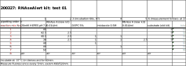

```{r setup, include=FALSE}
knitr::opts_chunk$set(echo = TRUE)
```

## Design of the test 

The idea is to test if the kit really works. Staring with the old kit (from Joe), only RNAse A used is from the new kit (from Josie). I also test Diethyl pyrocarbonate (DEPC), RNAse inhibitor. After the inhibitor is added and inhibiton is complete, Imidazole consumes surplus of the inhibitor. DEPC covalently modifies His, Lys, Cys, Tyr (be careful)!

#### Chemicals used in the reaction,
added in the following order in replicates of four, in squares on 96 well plate:

1. 20mM HEPES ph 7.0 buffer
2. RNAse A (fresh from the new kit), 0.01U/ml stock solution
3. DEPC (inhibitor), 0.1% in the reaction 
4. Imidazole (inhibitor quencher), 10mM in the reaction
5. RNAse A (fresh enzyme after the background has been inhibited)
6. substrate (fluorescein-RNA conjugate), already diluted used only 2.5ul insted of sugested 10ul 

#### Test conditions (volumes in microliters per well)


#### Here is Thermo [kit manual](https://www.thermofisher.com/document-connect/document-connect.html?url=https%3A%2F%2Fassets.thermofisher.com%2FTFS-Assets%2FLSG%2Fmanuals%2Ffm_1964.pdf&title=Uk5hc2VBbGVydCZ0cmFkZTsgTGFiIFRlc3QgS2l0IEluc3RydWN0aW9uIE1hbnVhbA==)

```{r libraries, echo=FALSE, include=FALSE}
#library("plyr")
library("dplyr")
#library("tidyr")
library("ggplot2")
```

## Data preparation

```{r data, echo=FALSE, include=FALSE}
## read in raw data
raw <- read.delim("data/export03list.txt",stringsAsFactors = FALSE)
colnames(raw)
str(raw)
head(raw)
#' remove column
raw <- raw[,1:10]
#' change names
colnames(raw)[7] <- "MeasTimeSec"

#' parse 'Sample' to obtain sample number 'SampleNo'
raw$Sample[1]
#substr(raw$Sample,1,regexpr(' ', raw$Sample)-1) 
raw$SampleNo <- substr(raw$Sample,1,regexpr(' ', raw$Sample)-1)

#' in the same way extract replicate number - 'RepNo'
#substr(raw$Sample,regexpr(' ', raw$Sample)+1, regexpr('/', raw$Sample)-1) 
raw$RepNo <- substr(raw$Sample,regexpr(' ', raw$Sample)+1, regexpr('/', raw$Sample)-1)

#' remove white space from 'Well' sting
#substr(raw$Well, 2, regexpr('$', raw$Well)) 
raw$Well<- substr(raw$Well, 2, regexpr('$', raw$Well))
head(raw) 
str(raw)
```
```{r cleaned data}
## show cleaned data with selected columns
#' Well, Sample, SampleNo, RepNo, MeasTimeSec, RFU
df <- raw[,c(3,6,11,12,7,8)] 
head(df) 
str(df)
```
## Plots

```{r plots}
#' all the data
#plot(x=raw$MeasTimeSec,y=raw$RFU)

#' colour labeled samples
ggplot(data = df) +
  aes(x = MeasTimeSec, y=RFU) +
  geom_point(aes(color=SampleNo))
```
```{r final result}
## Use summary statistics to remove one outlier in  sample 3
#' means of replicates for sample 3 
dfstat <- df %>% filter(SampleNo==3) %>% group_by(SampleNo,RepNo) %>% summarise(mean=mean(RFU))
dfstat
#' Data that should be removed
filter(df,SampleNo == 3 & RepNo == 1)
#' I could not invert the filter though
#' But we can simply leave our all measurement from the well E01
dfs <- filter(df, Well != "E01")

## LOESS regression
p <- ggplot(data = dfs) +
  aes(x = MeasTimeSec, y=RFU) +
  geom_smooth(aes(color=SampleNo)) +
  geom_jitter(aes(color=SampleNo),width = 0.5, height = 0.7, alpha=0.3)

  p + labs(title = "RNAseAlert Test (with the old substrate)", x = "min", y = "RFU", color = "Legend Title\n") +
  scale_colour_discrete(name="Conditions",
                      breaks=c(1,2,3,4,5,6,7,"air"),
                      labels=c("1: -RNAse",
                               "2: +RNAse",
                               "3: DEPC",
                               "4: DEPC +RNAse",
                               "5: DEPC",
                               "6: Imidazole",
                               "7: HEPES",
                               "8: air"))
```

## Conclutions
    
### Good:
- All the negative controls are nearly zero.
- All the tests where RNAse A was added shows some RFU values.
- Kinetic measuremet shows the underlying problems. 
 
### Not very good:
- Absolute intensity in positive controls is low.
- There is no gain of fluorescence over the time. 
- Inhibition did not work. I think HEPES is the problem. PBS or MOPS should be used instead.
 
- In all coonditions where RNAse was present, 
the result is almost the same. 
- It seem the reason could be not sufficient substrate concentration.
- The fluorescein was relesed instantaneously just after 
addition of RNAse. Thus at all observed time points we detected only 
a decay of the initially released fluorescence, instead of expected accumulation.
- Repeated measurement in 30 second interval gave the same result.
 
- It seems that chemicals added to inhibit RNAse A
preserve the fluorescence signal, without DEPC and Imidazol
the signal decays faster.

- When additinal RNAse was added to the negative control No.1 (buffer + substrate)
a fluorescence signal was released, but did not increase over time.    
 
### What next:
- Use more of the substrate.
- Use the new kit, with hopefully better substrate.
- Give the inhibitor more time, possibly higher concentraiton and or test a different buffer. 
-----------------  
-----------------


