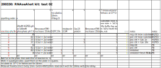

```{r setup, include=FALSE}
knitr::opts_chunk$set(echo = TRUE)
```
# Test of new kit and phosphate buffer
## Design

The idea is to test if the kit really works. Staring with the old kit (from Joe), only RNAse A used is from the new kit (from Josie). I also test Diethyl pyrocarbonate (DEPC), RNAse inhibitor. After the inhibitor is added and inhibiton is complete, Imidazole consumes surplus of the inhibitor. DEPC covalently modifies His, Lys, Cys, Tyr (be careful)!

#### Chemicals used in the reaction,
added in the following order in replicates of four, in squares on 96 well plate:

1. 20mM HEPES ph 7.0 buffer
2. Benzoase(TM)nuclease, 25U/ml stock solution
3. DEPC (inhibitor), 0.1% in the reaction 
4. Imidazole (inhibitor quencher), 10mM in the reaction
5. Benzoase(TM)nuclease (fresh enzyme after the background has been inhibited)
6. Cas13 2mg/ml was diluted: 5ul/153ul in a buffer from Josie, which gives 10x concentrated. Here we test 100x concentrated as well, test tubes 3 and 4 respectively. 
7. substrate (fluorescein-RNA conjugate), one tube designes for one test was used for all the test here - 28 replicates.  

#### Test conditions (volumes in microliters per well)


#### Here is Thermo [kit manual](https://www.thermofisher.com/document-connect/document-connect.html?url=https%3A%2F%2Fassets.thermofisher.com%2FTFS-Assets%2FLSG%2Fmanuals%2Ffm_1964.pdf&title=Uk5hc2VBbGVydCZ0cmFkZTsgTGFiIFRlc3QgS2l0IEluc3RydWN0aW9uIE1hbnVhbA==)

```{r libraries, echo=FALSE, include=FALSE}
#library("plyr")
library("dplyr")
#library("tidyr")
library("ggplot2")
```

## Data preparation

```{r data, echo=FALSE, include=FALSE}
## read in raw data
raw <- read.delim("data/200330_BuffersNewKit_test2.txt",stringsAsFactors = FALSE)
colnames(raw)
str(raw)
head(raw)
#' remove column
raw <- raw[,1:10]
#' change names
colnames(raw)[7] <- "MeasTimeSec"

#' parse 'Sample' to obtain sample number 'SampleNo'
raw$Sample[1]
#substr(raw$Sample,1,regexpr(' ', raw$Sample)-1) 
raw$SampleNo <- substr(raw$Sample,1,regexpr(' ', raw$Sample)-1)

#' in the same way extract replicate number - 'RepNo'
#substr(raw$Sample,regexpr(' ', raw$Sample)+1, regexpr('/', raw$Sample)-1) 
raw$RepNo <- substr(raw$Sample,regexpr(' ', raw$Sample)+1, regexpr('/', raw$Sample)-1)

#' remove white space from 'Well' sting
#substr(raw$Well, 2, regexpr('$', raw$Well)) 
raw$Well<- substr(raw$Well, 2, regexpr('$', raw$Well))
head(raw) 
str(raw)
```
```{r cleaned data}
## show cleaned data with selected columns
#' Well, Sample, SampleNo, RepNo, MeasTimeSec, RFU
df <- raw[,c(3,6,11,12,7,8)] 
head(df) 
str(df)
```
## Plots

```{r plots}
#' all the data
#plot(x=raw$MeasTimeSec,y=raw$RFU)

#' colour labeled samples
ggplot(data = df) +
  aes(x = MeasTimeSec, y=RFU) +
  geom_point(aes(color=SampleNo))
```
```{r final result}
# ## Use summary statistics (mean) to find and remove obvious  outlier in  sample 3
# #' means of all replicates of sample 3 
# dfstat <- df %>% filter(SampleNo==1) %>% group_by(SampleNo,RepNo) %>% summarise(mean=mean(RFU))
# dfstat
# #' Data that should be removed
# filter(df,SampleNo == 3 & RepNo == 3)
# #' I could not invert the filter though
# #' But it is the same as leaving out all the measurement from the well E01
# dfs <- filter(df, Well != "E06")
# #' all the measurements
# length(rownames(df))
# #'after 12 datapoints were removed
# length(rownames(dfs))

## LOESS regression
p <- ggplot(data = df) +
  aes(x = MeasTimeSec, y=RFU) +
  geom_smooth(aes(color=SampleNo)) +
  geom_jitter(aes(color=SampleNo),width = 0.5, height = 0.7, alpha=0.3)

  p + labs(title = "RNAseAlert Test (with the old substrate)", x = "min", y = "RFU", color = "Legend Title\n") +
  coord_cartesian(ylim = c(0,2)) +  
  scale_colour_discrete(name="Conditions",
                      breaks=c(1,2,3,4,5,6,7,8,"air"),
                      labels=c("1: HEPES-RNAse",
                               "2: HEPES+RNAse",
                               "3: HEPES+RNAse+Cas1x",
                               "4: HEPES+RNAse+Cas10x",
                               "5: PB",
                               "6: PB+RNase",
                               "7: PB+RNase+DEPC",
                               "8: PB+RNase+DEPC+RNAse",
                               "8: air"))
```

## Conclutions
    
### Good:
- In this test the Substrate was 28 fold diluted, still producing a consistent signal
 
### Not very good:
- Cas13 supresses the signal significantly
- 10mM phosphate kills the signal completelly. 

### What next:
- Use more of the substrate.
- HEPES
- HEPES, DEPC
- if phosphate, try 20mM


### Notes and references


-----------------  
-----------------


