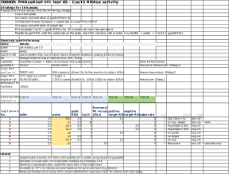

```{r setup, include=FALSE}
knitr::opts_chunk$set(echo = TRUE)
```
# Test of Cas13 RNAse activity


## Protocol:


#### Original RNAaseAlert [kit manual](https://www.thermofisher.com/document-connect/document-connect.html?url=https%3A%2F%2Fassets.thermofisher.com%2FTFS-Assets%2FLSG%2Fmanuals%2Ffm_1964.pdf&title=Uk5hc2VBbGVydCZ0cmFkZTsgTGFiIFRlc3QgS2l0IEluc3RydWN0aW9uIE1hbnVhbA==)


```{r libraries, echo=FALSE, include=FALSE}
#library("plyr")
library("dplyr")
#library("tidyr")
library("ggplot2")
```

## Data preparation
### Read in the data and parse some sample names 
```{r data, echo=TRUE, include=TRUE}
## read in raw data
raw <- read.delim("data/200409_RNAaseAlert_RNA2020-04-09T154233.txt",stringsAsFactors = FALSE)
colnames(raw)

#' remove column
raw <- raw[,1:10]
#' change names
colnames(raw)[7]
colnames(raw)[7] <- "MeasTimeSec"

#' parse 'Sample' to obtain sample number 'SampleNo'
raw$Sample[1]
#substr(raw$Sample,1,regexpr(' ', raw$Sample)-1) 
raw$SampleNo <- substr(raw$Sample,1,regexpr(' ', raw$Sample)-1)

#' in the same way extract replicate number - 'RepNo'
#substr(raw$Sample,regexpr(' ', raw$Sample)+1, regexpr('/', raw$Sample)-1)
raw$RepNo <- substr(raw$Sample,regexpr(' ', raw$Sample)+1, regexpr('/', raw$Sample)-1)

#' remove white space from 'Well' sting
#substr(raw$Well, 2, regexpr('$', raw$Well))[1:5]
raw$Well<- substr(raw$Well, 2, regexpr('$', raw$Well))
#' View(raw) 
str(raw)
```

### Corrections
Not this time.

```{r corrections, include=FALSE, echo=FALSE}
## ## Condition 1 and 2 are the same thing. Create new SampleComb where 2 is replace with 1

raw$SampleComb <- raw$SampleNo 
raw[raw$SampleComb==2,"SampleComb"] <- 1

unique(raw$SampleNo)
unique(raw$SampleComb)
#' Which means the control with +RNAse has 8 replicates, unlike all the other conditions that has only 4. 
```


### Subset of data for plotting
```{r cleaned data}
## Selected (cleaned) data, only columns needed for plotting
#' Well, Sample, SampleNo, RepNo, MeasTimeSec, RFU
colnames(raw)
df <- raw[,c(3,6,7,8,11,12)] 
head(df) 
str(df)
```
## Plots
### All data
```{r plots}
#' all the data
#plot(x=raw$MeasTimeSec,y=raw$RFU)

#' colour labeled samples
ggplot(data = df) +
  aes(x = MeasTimeSec, y=RFU) +
  geom_point(aes(color=SampleNo))
```

### Adjustments (if needed)
Not this time. A limit on axis x is need. It will be added to plots later.

```{r final result, include=FALSE, echo=FALSE}
# ## some adjustments
# ## Use summary statistics (mean) to find and remove obvious  outlier in  sample 3
# #' means of all replicates of sample 3 
# dfstat <- df %>% filter(Sample,No==1) %>% group_by(SampleNo,RepNo) %>% summarise(mean=mean(RFU))
# dfstat
# #' Data that should be removed
# filter(df,SampleNo == 3 & RepNo == 3)
# #' I could not invert the filter though
# #' But it is the same as leaving out all the measurement from the well E01
# dfs <- filter(df, Well != "E06")
# #' all the measurements
# length(rownames(df))
# #'after 12 datapoints were removed
# length(rownames(dfs))
```

### All data with description

```{r }
## LOESS regression,
p <- ggplot(data = df) + 
  aes(x = MeasTimeSec, y=RFU) +
  geom_smooth(aes(color=SampleNo)) +
  geom_point(aes(colour=SampleNo))

#' Panel of plots
p+facet_wrap(~SampleNo) +
  coord_cartesian(xlim = c(0,1000)) +
  labs(title = "Cas RNAse activity test", x = "sec", y = "RFU") +
  scale_colour_discrete(name="Conditions",
                        breaks=c(1,2,3,4,5,6,7,8,9),
                        labels=c("1: Cas 10x=>1x",
                                 "2: 2x Cas &target",
                                 "3: Neg target 2.5E5",
                                 "4: Neg target 2.5E8",
                                 "5: No guide",
                                 "6: No target",
                                 "7: No Cas",
                                 "8: Benzoase ",
                                 "9: air"))
#' All conditions together
  p + labs(title = "Cas RNAse activity test", x = "sec",   y = "RFU", color = "Legend Title\n") +
  coord_cartesian(xlim = c(0,1000)) +
  scale_colour_discrete(name="Conditions",
                      breaks=c(1,2,3,4,5,6,7,8,9),
                      labels=c("1: Cas 10x=>1x",
                                 "2: 2x Cas &target",
                                 "3: Neg target 2.5E5",
                                 "4: Neg target 2.5E8",
                                 "5: No guide",
                                 "6: No target",
                                 "7: No Cas",
                                 "8: Benzoase ",
                                 "9: air"))


```

The warning notifies us we have zoomed in the plot by putting limits on axes.

### Plots of subsets of selected conditions being tested

```{r subsets, include=TRUE, echo=TRUE}

## positive contorls vs some negative controls
p <- df[raw$SampleNo==1|df$SampleNo==2|df$SampleNo==3|df$SampleNo==4|df$SampleNo==5|df$SampleNo==7|df$SampleNo==9,]
## LOESS regression
p <- ggplot(data = p) +
  aes(x = MeasTimeSec, y=RFU) +
  geom_smooth(aes(color=SampleNo)) +
  geom_point(aes(colour=SampleNo))


p + labs(title = "RNAseAlert Test (with fresh substrate)", x = "sec",   y = "RFU", color = "Legend Title\n") +
  coord_cartesian(xlim = c(0,1000)) +
  scale_colour_discrete(name="Conditions",
                      breaks=c(1,2,3,4,5,7,9),
                      labels=c("1: Cas 10x=>1x",
                                 "2: 2x Cas &target",
                                 "3: Neg target 2.5E5",
                                 "4: Neg target 2.5E8",
                                 "5: No guide",
                                 "7: No Cas",
                                 "9: air"))


  
    
```

## Conclutions
### Observations
- The air and no Cas13 are the same - negative, all the other samples show some activity. That means there is an activity in Cas13.
- This activity, however is not specific. While without guide-RNA RNAse activity is the hihest, with the other recation components it is noticebly lower. It seems these components inhibit thi non specific  activity or interfere with fluorescence detection.
- The control with Benzoase is convincing engouh. Still I would expect a bit higher absolute RFU values.

### What next:
- ?


-----------------  
-----------------


