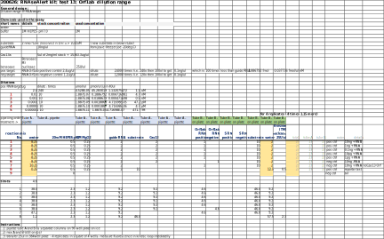

```{r setup, include=FALSE}
knitr::opts_chunk$set(echo = TRUE)
```
## Goals
1. Dilution range of Orf1ab RNA
2. Smaller volume in 384-well plate - Do we gain sensitivity?
 


## Protocol:


#### Original RNAaseAlert [kit manual](https://www.thermofisher.com/document-connect/document-connect.html?url=https%3A%2F%2Fassets.thermofisher.com%2FTFS-Assets%2FLSG%2Fmanuals%2Ffm_1964.pdf&title=Uk5hc2VBbGVydCZ0cmFkZTsgTGFiIFRlc3QgS2l0IEluc3RydWN0aW9uIE1hbnVhbA==)


```{r libraries, echo=FALSE, include=TRUE}
library("dplyr")
library("ggplot2")
```

## Data preparation
### Read data into R  
```{r data, echo=TRUE, include=TRUE}
## read in raw data and some annotation
raw <- read.delim("data/200626_dilutions_Orf1ab2020-06-26T204241.txt", stringsAsFactors = FALSE)
colnames(raw)
```

### Annotation to be used in plots
Sample names and  conditions for plot legends
```{r}
title  <- "384-well plate assay with Orf1ab RNA"
name <- "Conditions:"
IDs <- as.character(seq(1:9))
labels <-  c("(+) 10ng RNA",
            "(+) 1ng RNA",
            "(+) 100pg RNA",
            "(+) 10pg RNA",
            "(+) 1pg RNA",
            "(-) 10ng RNA",
            "(-) 10ng RNA",
            "(+), substrate",
            "(-), air")
labels <- paste(IDs, labels, sep=": ")
labels
```
### Calculations of RNA concentration

```{r}
## calculation of target RNA concentraion 
ng <- c(10,1,0.1,0.01,0.001)
nmol <- ng/53000
pM <- 1e9*nmol/25  #nmol/ul...umol/ml...mmol/l...mM...x1e9=>pM
cop <- nmol/1E9*6E23


ng <- formatC(ng,format = "g", digits = 3)
nmol <- formatC(nmol,format = "e", digits = 1)
pM <- formatC(pM,format = "g", digits = 1)
cop <- formatC(cop,format = "e", digits = 0)

## per reaction
data.frame("ng"=ng,"nmol"=nmol,"pM"=pM,"copy number"=cop)
```


### Change some sample names
```{r include=TRUE, echo=TRUE, eval=TRUE}
#' remove 'X' column
raw <- raw[,1:10]
#' change names
colnames(raw)[7]
colnames(raw)[7] <- "MeasTimeSec"

#' parse 'Sample' to obtain sample number 'SampleNo'
raw$SampleNo <- substr(raw$Sample,1,regexpr(' ', raw$Sample)-1)

#' in the same way extract replicate number - 'RepNo'
raw$RepNo <- substr(raw$Sample,regexpr(' ', raw$Sample)+1, regexpr('/', raw$Sample)-1)

#' remove white space from 'Well' sting
raw$Well<- substr(raw$Well, 2, regexpr('$', raw$Well))

#' convert SampleNo to factor in order it to sort nicely in ggplots
raw$SampleNo <- as.factor(raw$SampleNo)
raw$SampleNo <- factor(raw$SampleNo, IDs) 
unique(raw$SampleNo)
```

### Corrections
Not used this time.

```{r corrections, include=FALSE, echo=FALSE, eval=FALSE}
## ## Condition 1 and 2 are the same thing. Create new SampleComb where 2 is replace with 1

raw$SampleComb <- raw$SampleNo 
raw[raw$SampleComb==2,"SampleComb"] <- 1

unique(raw$SampleNo)
unique(raw$SampleComb)
#' Which means the control with +RNAse has 8 replicates, unlike all the other conditions that has only 4. 
```


### Subset of data for plotting
```{r cleaned data}
# Selected (cleaned) data contains only columns needed for plotting
# Well, Sample, SampleNo, RepNo, MeasTimeSec, RFU
colnames(raw)
df <- raw[,c(3,6,7,8,11,12)] 
head(df) 
# str(df)
# there should be no missing values
table(is.na(df))
```
## Plots
### All data
```{r plots, eval=TRUE, include=TRUE, echo=TRUE}
# all the data
# plot(x=raw$MeasTimeSec,y=raw$RFU)

# colour by samples
ggplot(data = df) +
  aes(x = MeasTimeSec, y=RFU) +
  geom_point(aes(color=SampleNo)) +
  scale_color_discrete(name=name, breaks=IDs, labels=labels)

```


### Final adjustments of data
Not used this time.
```{r final result, include=FALSE, eval=FALSE, echo=FALSE}
## Adjustments - remove outliers if necessary

#' Measurement of this sample have many outliers
#dfp <- df %>% filter(SampleNo ==7) %>%
ggplot(subset(df, SampleNo %in% c(7))) +
  aes(x = MeasTimeSec, y=RFU) +
  geom_point(aes(color=SampleNo))

## Use summary statistics (mean) to find and remove obvious  outliers 
#' means of all replicates of sample 3
dfstat <- df %>% filter(SampleNo==1|SampleNo==2|SampleNo==3|SampleNo==4|SampleNo==5|SampleNo==6|SampleNo==7|SampleNo==8) %>% group_by(SampleNo,RepNo) %>% summarise(mean=mean(RFU))
dfstat
#View(dfstat)

#' Data that should be removed
df %>% filter(SampleNo==7 & RepNo==3)
#filter(df,SampleNo == 7 & RepNo == 3)

#View(df)
#' I do not know how to invert the filter 
#' Though it is the same as leaving out all the measurement from the wells in the first column
#'dfs <- filter(df, Well != "A01" & Well != "B01" & Well != "C01"&  Well != "D01"& Well != "E01"& Well != "F01" & Well != "G01"& Well != "H01")
dfs <- filter(df, Well != "G03")
#' all the measurements
length(rownames(df))
#'removinf onw column should remove 8*60 datapoints
length(rownames(dfs))
#' There are some zeros (negative spikes) in Sample "7 1/3" 
#' Let's removethose  zeros here
dfs[which(dfs$Sample=="7 1/3"&dfs$RFU==0),]
dfs[which(dfs$Sample=="7 1/3"&dfs$RFU==0),] <- NA

length(rownames(dfs))
table(is.na(dfs))
dfs <- dfs[complete.cases(dfs),]
table(is.na(dfs))
#dfs[which(is.na(dfs)),]


#' Correct - replace the original data with reduced dataframe  
df <- dfs
table(is.na(df))
```

### Panels of plots
```{r}
## LOESS regression,
p <- ggplot(data = df) + 
  aes(x = MeasTimeSec, y=RFU) +
  geom_smooth(aes(color=SampleNo)) +
  geom_point(aes(colour=SampleNo))

## Panel of plots fixed scale
p+facet_wrap(~SampleNo, scales = "free_y") +
  #coord_cartesian(xlim = c(0,500)) +
  labs(title = title, x = "sec", y = "RFU") +
  scale_colour_discrete(name=name, breaks=IDs, labels=labels)
## Panel of plots zoomed
p+facet_wrap(~SampleNo, scales = "free_y") +
  coord_cartesian(xlim = c(0,500)) +
  labs(title = title, x = "sec", y = "RFU") +
  scale_colour_discrete(name=name, breaks=IDs, labels=labels)

# ## All conditions together
#   p + labs(title = title, x = "sec",   y = "RFU", color = "Legend Title\n") +
#   #coord_cartesian(xlim = c(0,1000)) +
#   scale_colour_discrete(name=name, breaks=IDs, labels=labels)


```


### Plots of subsets of samples and conditions
Not used this time
```{r subsets, include=FALSE, echo=FALSE, eval=FALSE}
## Crude Orf1ab
p1 <- df[df$SampleNo==1|df$SampleNo==2|df$SampleNo==3|df$SampleNo==4,]
## Crude S
p2 <- df[df$SampleNo==5|df$SampleNo==6,]
## StrepTrap Orf1ab
p3 <- df[df$SampleNo==7|df$SampleNo==8,]
## StrepTrap S
#p4 <- df[df$SampleNo==9|df$SampleNo==10,]
## CIEX Orf1ab
#p5 <- df[df$SampleNo==11|df$SampleNo==12,]
## CIEX S
#p6 <- df[df$SampleNo==13|df$SampleNo==14,]
## substrate and air
#p7 <- df[df$SampleNo==15|df$SampleNo=="air",]

myplots <- list("p1"=p1,"p2"=p2,"p3"=p3)
class(myplots)
str(myplots)


## LOESS regression
for(p in myplots){
p <- as.data.frame(p)

print(ggplot(data = p) +
  aes(x = MeasTimeSec, y=RFU) +
  geom_smooth(aes(color=SampleNo)) +
  geom_point(aes(colour=SampleNo)) +
  labs(title = title, x = "sec",   y = "RFU", color = "Legend Title\n") +
  #coord_cartesian(xlim = c(0,1000)) +
  scale_colour_discrete(name=name, breaks=IDs, labels=labels))
}
```


### Notes

- For this assay I used target concentration from 10ng/ul down to 1pg/ul (1ul used in well). Detection limit seems to be 10pg, which is pM range or 1 x E8 copies.
- assay in 384-well plate format is more sensitive, presumably due to longer optical lenght
- 10 ul of substrate is a lot, but it provides nice signal. Protocol mentions 1ul, but that seems to be just detectable.

## Conclusions and what next?

- S RNA
- T7 RNApol
- automation

-----------------  
-----------------


