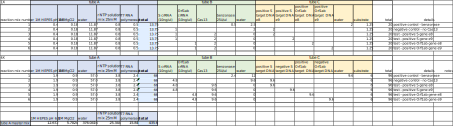

```{r setup, include=FALSE}
knitr::opts_chunk$set(echo = TRUE)
```

## Goals	
Repeat Centrum assay 1, including higher starting concentration of DNA. Using a simpler layout reduces any chance of error. 	
	
	
## Notes	
- Did not include murine, Jan's tests have not shown significant RNAse activity in negative control and we have limited murine	
- Started with target DNA at E8 copies/ul (one order of magnitude higher than suggested by Broad Institute to be on the safe side)	
- Read over 4 hours, to give transcription time to take place	
Split Jan's tube A into A and B, to allow preparation of tube A "master mix" with less pipetting	
	
	
	
## Chemicals used in the assay	
name |	details

- 1M HEPES pH 6.8	filter sterilised
- 1M MgCl2 filter sterilised
rNTP solution mix	currently in SHERLOCK box, -20 Centrum
T7 RNA polymerase	currently in SHERLOCK box, -20 Centrum, reordered from NEB. Supplied at 50,000U/ml, needed at 5U/ul, made 10X dilution in supplied polymerase buffer (1.6ul enzyme in 14.4ul buffer). 
- crRNA	made dilution from fresh stock aliquot from -80 (TSL)
- Cas13	Cas13 protein 10x; 5ul of stock Cas13 (2mg/ml) diluted by adding 153ul of strorage buffer (SB)
- target DNA	Dilutions in next sheet
- substrate	Invitrogen Rnase Alert v2 kit, 50pmol per tube. Resuspended 3x tubes in 25ul supplied buffer each, to give 2uM substrate. 
- benzonase	 25U/ul




## Protocol:	
1.	Prepare tubes A, B, and C, mix them, then pipette all on plate using dispensing pipette
2.	Volumes in table are for 4 replicates per reaction mix, 20ul reaction volume
3.	Working in quadruplicates, pipet the replicates 
4.	Incubate at  37°C (in Varioscan) and measure for up to one hour (e.g. 36min).
5.	Measure fluorescence every 2min, ex/em 490/520nm, read each well for 100ms with 10ul delay.


```{r libraries, echo=FALSE, include=TRUE}
library("tidyverse")
library("ggplot2")
```

## Data preparation
### Read data into R  
```{r data, echo=TRUE, include=TRUE}
## read in raw data and some annotation
setwd("C:/1_R/aRmy/200327_RNAseAlert/RNAseAlert")
raw <- read.csv("data/fromJosie/200819_SHERLOCK_centrum04_Results.csv", stringsAsFactors = FALSE)
colnames(raw)
dim(raw)
head(raw)
tail(raw)
# get rid of NAs
raw <- raw[complete.cases(raw),]
dim(raw)

```

### Rename columns
Infomation about layout is in the Excel spreasheet.
```{r rename, echo=TRUE, include=TRUE}
mynames <- c("Reading","MeasTimeSec",
             paste(rep("reaction_1",4),"-",seq(1:4)),
             paste(rep("reaction_2",4),"-",seq(1:4)),
             paste(rep("reaction_3",4),"-",seq(1:4)),
             paste(rep("reaction_4",4),"-",seq(1:4)),
             paste(rep("reaction_5",4),"-",seq(1:4)),
             paste(rep("reaction_6",4),"-",seq(1:4)))
mynames
names(raw) <- mynames
#names(raw)
#dim(raw)
#head(raw)

```


### Common annotations to be used in plots
Sample names and  conditions for plot legends.
```{r}
title  <- "200819: Josie No.4, 384-well"
mysubtitle <- "Cas13 RNAse activity assay"
name <- "Conditions:"
IDs <- as.character(seq(1:6))
mycolors <- c("blue","royalblue","aquamarine3","aquamarine2","lightblue2","lightblue3")
mylabels <-  c("(+) benzoase",
             "(-) no Cas13",
             "(+) S gene e8",
             "(+) S gene e9",
             "(+) Orf1ab gene e8",
             "(+) Orf1ab gene e9")
mylabels <- paste(IDs, mylabels, sep=": ")
names(mylabels) <- IDs
```
<!---
### Calculations of RNA concentration
-->
```{r include=FALSE, echo=FALSE, eval=FALSE}
## Calculation of target RNA concentration
#   To the reaction in one well, here 25ul, we add 1ul of RNA. 
#   Since the target concetration is in ng/ul, then 
ng <- c(10,1,0.1,0.01,0.001)
nmol <- ng/53000
pM <- 1e9*nmol/25  #nmol/ul...umol/ml...mmol/l...mM...x1e9=>pM
cop <- nmol/1E9*6E23


ng <- formatC(ng,format = "g", digits = 3)
nmol <- formatC(nmol,format = "e", digits = 1)
pM <- formatC(pM,format = "g", digits = 1)
cop <- formatC(cop,format = "e", digits = 0)

## per reaction
data.frame("ng"=ng,"nmol"=nmol,"pM"=pM,"copy number"=cop)
```

### Conversion to a long data format
```{r long, echo=TRUE, include=TRUE}

df <- gather(raw, key = "Sample", value = "RFU", -"MeasTimeSec", -"Reading")
head(df)
table(is.na(df))
#df[is.na(df),]

```


### Change some sample names
```{r include=TRUE, echo=TRUE, eval=TRUE}
#' remove columns if necessary
colnames(df)

#' change names in necessary
colnames(df)

#' parse 'Sample' to obtain sample number 'SampleNo'
df$Sample[1]
df$SampleNo <- substr(df$Sample,regexpr('_', df$Sample)+1,regexpr(' - ', df$Sample)-1)
head(df$SampleNo)
table(is.na(df$SampleNo))

#' in the same way extract replicate number - 'RepNo'
df$RepNo <- substr(df$Sample,regexpr(' - ', df$Sample)+3, regexpr('$', df$Sample))
head(df$RepNo)

#' Change sec to min
table(is.na(df$MeasTimeSec))
df$MeasTimeMin <- df$MeasTimeSec/60
head(df$MeasTimeMin)
#' remove white space from 'Well' sting
#df$Well<- substr(df$Well, 2, regexpr('$', df$Well))

#' convert SampleNo to factor in order it to sort nicely in ggplots
df$SampleNo <- as.factor(df$SampleNo)
df$SampleNo <- factor(df$SampleNo, levels=IDs) 
unique(df$SampleNo)
```


### Subset of data for plotting if necessary
```{r cleaned data}
# Selected (cleaned) data contains only columns needed for plotting
# Well, Sample, SampleNo, RepNo, MeasTimeSec, RFU
colnames(df)
df <- df[,c(1,2,3,4,5,6,7)] 
head(df) 
# there should be no missing values
table(is.na(df))
df[!complete.cases(df),]


```
## Plots
### All the data
```{r plots, eval=TRUE, include=TRUE, echo=TRUE}
# all the data
# plot(x=df$MeasTimeSec,y=df$RFU)

# colour by samples
ggplot(data = df) +
  aes(x = MeasTimeMin, y=RFU) +
  geom_point(aes(color=SampleNo)) +
  scale_color_discrete(name=name, breaks=IDs, labels=mylabels)

```


### Data adjustments if necessary
Removal of bad replicates and outliers
```{r final result, include=TRUE, eval=TRUE, echo=TRUE}
## Adjustments - remove outliers if necessary

## Sometimes samples needs to be combined...
#  df$SampleComb <- df$SampleNo 
#  df[df$SampleComb==2,"SampleComb"] <- 1

## Measurement of this sample have many outliers...
#  ggplot(subset(df, SampleNo %in% c(7))) +
#  aes(x = MeasTimeSec, y=RFU) +
#  geom_point(aes(color=SampleNo))

## Use summary statistics (mean) to find and remove obvious outliers...
#  means of all replicates 
dfstat <- df %>% filter(SampleNo==1|SampleNo==2|SampleNo==3|SampleNo==4|SampleNo==5|SampleNo==6) %>% group_by(SampleNo,RepNo) %>% summarise(mean=mean(RFU))
print(dfstat,n=nrow(dfstat))
#View(dfstat)

# Data that should be removed
#dim(df) 
#dim(df %>% filter(RepNo==1))
#dim(df %>% filter(RepNo!=1))
#df <- df %>% filter(RepNo!=1)

## To invert filter...
#  filter(df,SampleNo == 7 & RepNo == 3)
#  It is the same as leaving out all the measurement from some wells
#  df <- filter(df, Well != "A01" & Well != "B01" & Well != "C01"&  Well != "D01"& Well != "E01"& Well != "F01" & Well != "G01"& Well != "H01")

## Filter can be also inverted using... 
#  df <- filter(df, Well != "G03")

## To remove some data...
#  There are some zeros (negative spikes) in Sample "7 1/3" 
#  Let's removethose  zeros here
#  df[which(df$Sample=="7 1/3"&df$RFU==0),]
#  dfs[which(dfs$Sample=="7 1/3"&dfs$RFU==0),] <- NA

## Checks...
head(df)
length(rownames(df))
length(complete.cases(df))
table(is.na(df))
## only complete cases
df[which(is.na(df)),]
df <- df[complete.cases(df),]
## check for NAs
```

### Panels of plots
```{r}
## LOESS regression,
p <- ggplot(data = df) + 
  aes(x = MeasTimeMin, y=RFU) +
  geom_smooth(aes(color=SampleNo)) +
  geom_point(aes(colour=SampleNo))

## Panel of plots fixed scale
p+facet_wrap(~SampleNo, scales = "free_y") +
  #coord_cartesian(xlim = c(0,500)) +
  labs(title = title, x = "sec", y = "RFU") +
  scale_colour_discrete(name=name, breaks=IDs, labels=mylabels)
## Panel of plots zoomed
p+facet_wrap(~SampleNo, scales = "free_y") +
  coord_cartesian(xlim = c(60,140)) +
  labs(title = title, x = "sec", y = "RFU") +
  scale_colour_discrete(name=name, breaks=IDs, labels=mylabels)


```


### Regression RFU~time plot
```{r}
# limit the time to where is appears to be the most linear
p <- ggplot(data=subset(df,MeasTimeMin>=60 & MeasTimeMin<=140), aes(x=MeasTimeMin,y=RFU,colour=factor(SampleNo))) + 
geom_point() + 
geom_smooth(method='lm',formula=y~x,se=T)

p

## Panel of plots fixed scale
p+facet_wrap(~SampleNo, scales = "free_y") +
  #coord_cartesian(xlim = c(0,500)) +
  labs(title = title, x = "sec", y = "RFU") +
  scale_colour_discrete(name=name, breaks=IDs, labels=mylabels)


p+facet_wrap(~SampleNo, scales = "free_y") +
  #coord_cartesian(xlim = c(4000,9000)) +
  labs(title = title, x = "sec", y = "RFU") +
  scale_colour_discrete(name=name, breaks=IDs, labels=mylabels)

``` 

#### Observation: 
Obviously, most of the dfata are not withing 95% the confidence intervals. 


## Example for one plot only
Copied form: [Regression on the plot](https://intellipaat.com/community/7335/adding-regression-line-equation-and-r2-on-graph)

```{r include=FALSE, echo=FALSE, eval=FALSE}
df <- data.frame(x = c(1:100))
df$y <- 2 + 3 * df$x + rnorm(100, sd = 40)

p <- ggplot(data = df, aes(x = x, y = y)) +
            geom_smooth(method = "lm", se=FALSE, color="black", formula = y ~ x) +
            geom_point()

lm_eq <- function(df){
    m <- lm(y ~ x, df);
    eq <- substitute((y) == a + b %.% (x)*","~~(r)^2~"="~r2, 
         list(a = format(unname(coef(m)[1]), digits = 2),
              b = format(unname(coef(m)[2]), digits = 2),
             r2 = format(summary(m)$r.squared, digits = 3)))
    as.character(as.expression(eq));
}

p1 <- p + geom_text(x = 25, y = 300, label = lm_eq(df), parse = TRUE)

p1
```
Now we have to do it for all the samples.

```{r include=FALSE, echo=FALSE, eval=FALSE}
# Another idea... printing ggplots subsets using a factor
library("datasets")
library("dplyr")
data(iris)
summary(iris)
class(iris)
p <- iris %>% group_by(Species) %>% do(plots=ggplot(data=.) +
         aes(x=Petal.Width, y=Petal.Length) + 
           geom_point() + 
           ggtitle(unique(.$Species)))
print(p$plots)

```


### Now let's put these solutions together


```{r include=TRUE, echo=TRUE, eval=TRUE}
## Now when we know how to limit regression
df  <-  subset(df,df$MeasTimeMin>60 & df$MeasTimeMin<=140)
head(df)
dim(df)

# 
# p <- df %>% group_by(SampleNo) %>% do(plots=ggplot(data=.) +
#          aes(x=MeasTimeSec, y=RFU) + 
#            geom_point() + 
#            geom_smooth(method = "lm", se=FALSE, color="black", formula = y ~ x) +
#            ggtitle(unique(.$SampleNo))) 
# # print plots held by the object p
# print(p$plots)


# this writes regression equation
lm_eq <- function(df,x,y){
    m <- lm(y ~ x, df);
    eq <- substitute((y) == a + b %.% (x)*","~~(r)^2~"="~r2, 
         list(a = format(unname(coef(m)[1]), digits = 2),
              b = format(unname(coef(m)[2]), digits = 2),
             r2 = format(summary(m)$r.squared, digits = 3)))
    as.expression(eq); # this works for title/subtitle
    # as.character(as.expression(eq)); # this works for geom_text
}


p <- df %>% group_by(SampleNo) %>% do(plots=ggplot(data=.) +
         aes(x=MeasTimeMin, y=RFU) + 
           geom_point() + 
           geom_smooth(method = "lm", se=FALSE, color="black", formula = y ~ x) +
           ggtitle(mylabels[unique(.$SampleNo)], subtitle = lm_eq(.,.$MeasTimeMin,.$RFU)))
          # geom_text(x = 25, y = 300, label = lm_eq(., .$MeasTimeSec, .$RFU), parse = TRUE))

# print plots held by the object p
#print(p$plots[1])
print(p$plots)


r <- df %>% group_by(SampleNo, RepNo) %>% do(plots=ggplot(data=.) + aes(x=MeasTimeMin, y=RFU) + 
geom_point() + 
geom_smooth(method = "lm", se=FALSE, color="black", formula = y ~ x) +
ggtitle(mylabels[unique(.$SampleNo)], subtitle = lm_eq(.,.$MeasTimeMin,.$RFU)))

print(r$plots)


## All together in a panel 
# replicates together
df %>% group_by(SampleNo) %>% ggplot(data=.) +
         aes(x=MeasTimeMin, y=RFU) + 
           geom_point() + 
           geom_smooth(method = "lm", se=FALSE, color="black", formula = y ~ x) +
#           ggtitle(mylabels[unique(.$SampleNo)], subtitle = lm_eq(.,.$MeasTimeMin,.$RFU)) +
   facet_wrap(~SampleNo, scales = "free")


# replicates separately
df %>% group_by(SampleNo, RepNo) %>% ggplot(data=.) +
         aes(x=MeasTimeMin, y=RFU) + 
           geom_point() + 
           geom_smooth(method = "lm", se=FALSE, color="black", formula = y ~ x) +
#           ggtitle(mylabels[unique(.$SampleNo)], subtitle = lm_eq(.,.$MeasTimeMin,.$RFU)) +
   facet_grid(SampleNo~RepNo, scales = "free")


```

## Gradients
### So what next? What is the best quantitative value for comparisons?

While it is nice to see the regression, what values are the best to compare for a robust quantitation?
There are two the most obvious  possibilities:

1. Sum of all RFU values for each over the whole time range.
2. Fit a linear regression to the time course and use the gradient for quantitative comparison.  

The former method is the simplest.

The latter method shows all the details of the time course; Cas13a kinetics at fixed substrate concentration. The gradient is definitelly more robust than sum. But we have to check linearity RFU ~ time course. 

Moreover, if the assay was well designed, and mesurement is taken above [S]>>Km, close to Vmax, perhaps we could calculate the tangent to plot dP/dt vs t like in: Claro, Enrique. (2000). Understanding initial velocity after derivatives of progress curves. Biochemistry and Molecular Biology Education. 28. 304-306? [link](https://www.sciencedirect.com/science/article/abs/pii/S1470817500000497)


```{r}
colnames(df)
lin <- df %>% group_by(SampleNo) %>% do(lm(.$RFU ~ .$MeasTimeMin,data=.) %>% coef() %>% as_tibble())
library("tidyr")

lin$SampleNo <- as.numeric(factor(lin$SampleNo))
lin

lin$lin_coef <- rep(c("a","b"),times=length(lin$SampleNo)/2)
lin

lin_wide <- lin %>% pivot_wider(., names_from=lin_coef, values_from=value) 
lin_wide


# Why are some x-axis labels hidden?
# How to get x-axis labels replaced by someting more sensible - "mylabels"
# see [link](https://www.tutorialspoint.com/why-scale-fill-manual-does-not-fill-the-bar-with-colors-created-by-using-ggplot2-in-r)
# fill needs a factor


ggplot(lin_wide, aes(x=SampleNo, y=b, fill=as.factor(SampleNo))) + 
  geom_bar(stat = "identity") +
  scale_fill_manual(name=name,labels=mylabels, values = mycolors) +
  labs(title = "The gradient of linear fit of RFU ~ time course", subtitle=mysubtitle)


  
# The same plot coded in another way (base R) 
op <- par(mar = c(8,4,4,2) + 0.1) ## default is c(5,4,4,2) + 0.1
op

barplot(lin_wide$b,
main = "The gradient of linear fit of RFU ~ time course",
sub = mysubtitle,
xlab = "Reactions",
ylab = "Gradient",
#names.arg = seq(1:6), las=1,
names.arg = mylabels, las=2,
col = mycolors,
horiz = FALSE)
box()

legend("topright",                                    # Add legend to barplot
       legend = mylabels,
       fill = mycolors)


```


### When we take replicates individualy...

```{r}
colnames(df)
lin <- df %>% group_by(SampleNo, RepNo) %>% do(lm(.$RFU ~ .$MeasTimeMin,data=.) %>% coef() %>% as_tibble())
library("tidyr")

lin$RepNo <- as.numeric(factor(lin$RepNo))
lin

lin$lin_coef <- rep(c("a","b"),times=length(lin$RepNo)/2)
lin

lin_wide <- lin %>% pivot_wider(., names_from=lin_coef, values_from=value) 
lin_wide


# Why are some x-axis labels hidden?
# How to get x-axis labels replaced by someting more sensible - "mylabels"
# see [link](https://www.tutorialspoint.com/why-scale-fill-manual-does-not-fill-the-bar-with-colors-created-by-using-ggplot2-in-r)
# fill needs a factor


# plot replicate gradient
ggplot(lin_wide, aes(x=SampleNo, y=b)) + 
  geom_bar(aes(fill=as.factor(RepNo)), stat = "identity", position = "dodge") +
  scale_fill_manual(name=name,labels=mylabels, values = mycolors) +
labs(title = "The gradient of linear fit of RFU ~ time course", subtitle=mysubtitle)


# boxplot is the best
ggplot(lin_wide, aes(x=SampleNo, y=b)) + 
  geom_boxplot(aes(fill=SampleNo), outlier.shape = NA) +
  geom_jitter(aes(alpha=0.1)) +
  scale_fill_manual(name=name,labels=mylabels, values = mycolors) +
  labs(title = "The gradient of linear fit of RFU ~ time course", subtitle=mysubtitle)

# And for comparison, 
# what we get when we sum all the data withing replicates...
ggplot(df, aes(x=SampleNo, y=RFU)) +
  geom_bar(aes(fill=RepNo), stat = "identity", position = "dodge") +
  scale_fill_manual(name=name,labels=mylabels, values = mycolors) +
    labs(title = "The sum of all data in RFU ~ time course",
         subtitle = mysubtitle)


# box plot of sums
s <- df%>% group_by(SampleNo, RepNo) %>% summarise(SmplSum=sum(RFU))

ggplot(s, aes(x=SampleNo, y=SmplSum)) + 
  geom_boxplot(aes(fill=SampleNo), outlier.shape = NA) +
  geom_jitter(aes(alpha=0.1)) +
  scale_fill_manual(name=name,labels=mylabels, values = mycolors) +
  labs(title = "The sum of all data in RFU ~ time course", subtitle=mysubtitle)


## What is the answer to what metrics is better, sum or gradient? THere is an obvious oulier in the positive control, that is clearly visible only when we calculate the regressions. But the linearity requirement is clearly more demanding on the data analysis.  
## The total sum of RFU values shows quite a different picture. It woudl help to analyze more data to see what is correct and practical.


```


```{r include=FALSE, echo=FALSE, eval=FALSE}
## M-M kinetics is not relevant to this measurement
library("nlstools")
data(vmkm)
nls1 <- nls(michaelis,vmkm,list(Km=1,Vmax=1))
plotfit(nls1, smooth = TRUE)

```


### Plots of subsets of samples and conditions to compare
 Not used this time
```{r subsets, include=FALSE, echo=FALSE, eval=FALSE}
## Crude Orf1ab
p1 <- df[df$SampleNo==1|df$SampleNo==2|df$SampleNo==3|df$SampleNo==4,]
## Crude S
p2 <- df[df$SampleNo==5|df$SampleNo==6,]
## StrepTrap Orf1ab
#p3 <- df[df$SampleNo==7|df$SampleNo==8,]
## StrepTrap S
#p4 <- df[df$SampleNo==9|df$SampleNo==10,]
## CIEX Orf1ab
#p5 <- df[df$SampleNo==11|df$SampleNo==12,]
## CIEX S
#p6 <- df[df$SampleNo==13|df$SampleNo==14,]
## substrate and air
#p7 <- df[df$SampleoN==15|df$SampleNo=="air",]

myplots <- list("p1"=p1,"p2"=p2)#,"p3"=p3)
class(myplots)
str(myplots)


## LOESS regression
for(p in myplots){
p <- as.data.frame(p)

print(ggplot(data = p) +
  aes(x = MeasTimeMin, y=RFU) +
  geom_smooth(aes(color=SampleNo)) +
  geom_point(aes(colour=SampleNo)) +
  labs(title = title, x = "sec",   y = "RFU", color = "Legend Title\n") +
  #coord_cartesian(xlim = c(0,1000)) +
  scale_colour_discrete(name=name, breaks=IDs, labels=mylabels))
}
```


### Notes

- Confidence intervals when all data points are treated independently are not very good
- Indeed, correlation coefficients evidence that 
- It should help to  calculate the gradient of each replicate individually, then calculate summary stats from all the replicates. It is a sensitive method to spot an odd sample, e.g there is an outlier in the positive control
- It is also possible to use the sum of all RFU values for a replicate, though the numbers are quite different. I think we need more data to be sure what is the best.
- 
- 

-----------------  
-----------------


